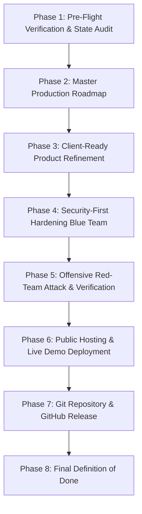

# TaskConnect: Master Production Roadmap (PLAN.md)

**Project:** TaskConnect — Airtasker-Style Community Marketplace  
**Engineers:** Lead Engineer, Security Engineer, DevOps Engineer  
**Repository:** https://github.com/ranaumarbilal31/Get-It-Done  
**Status:** Phase 7 Complete (Repository Live on GitHub at v1.0.0)  

---

## Roadmap Overview & Phases

---

## Detailed Task Breakdown

### Phase 3: Client-Ready Product Refinement (Engineering)
- [x] **Task 3.1: Dependency Modernization & Vulnerability Remediation**
  - Remediated high/moderate vulnerabilities (`qs`, `nodemailer`, updated build).
- [x] **Task 3.2: Input Validation & Sanitization Layer**
  - Configured **Zod** validation middleware across all auth, task, offer, review, and admin endpoints.
- [x] **Task 3.3: Production Storage Adapter (Cloudinary / Supabase / Base64 Data URI)**
  - Implemented multi-tier storage adapter (`storageService.js`) ensuring persistent images across Render container restarts.
- [x] **Task 3.4: Automated Test Suite (Unit & Integration Tests)**
  - Installed Vitest + Supertest; wrote 15 core API tests in `server/test/api.test.js`.
- [x] **Task 3.5: Legal & Client Deliverables**
  - Added `LICENSE` (MIT), `TERMS.md` (Terms of Service), and `PRIVACY.md` (Privacy Policy).

---

### Phase 4: Security-First Hardening (Blue Team / Defense)
- [x] **Task 4.1: Threat Modeling & Security Policy Documentation (`SECURITY.md`)**
  - Documented STRIDE threat model, trust boundaries, and OWASP Top 10 countermeasures.
- [x] **Task 4.2: HTTP Security Headers & Helmet Configuration**
  - Installed and configured `helmet` with custom CSP for OpenStreetMap and avatar sources.
- [x] **Task 4.3: Rate Limiting & Brute-Force Defense**
  - Configured `express-rate-limit` (15 attempts/15 min for auth; 120 req/min for API).
- [x] **Task 4.4: CORS & Environment Lock-down**
  - Restricted CORS to authorized client URLs.
- [x] **Task 4.5: CI/CD Security Scanning Workflow**
  - Created `.github/workflows/ci.yml` running lint, test, build, and security checks on push.

---

### Phase 5: Offensive Security Testing (Red Team / Attack)
- [x] **Task 5.1: Attack Test Plan Formulation**
  - Formulated penetration plan covering SQLi, XSS, IDOR, privilege escalation, and business logic flaws.
- [x] **Task 5.2: Red-Team Attack Script Execution**
  - Executed automated penetration test suite (`server/test/redteam.test.js`); all 12 attack vectors mitigated (27/27 tests passing).
- [x] **Task 5.3: Security Assessment Report (`SECURITY_REPORT.md`)**
  - Produced detailed attack-and-defense record with 0 unmitigated Critical/High findings.

---

### Phase 7: GitHub Repository & Release
- [x] **Task 7.1: Git Initialization & Secret Scrubbing**
  - Verified `.gitignore` prevents `.env`, `dev.db`, and `uploads/` from being tracked.
- [x] **Task 7.2: Conventional Commits & Documentation Sync**
  - Clean commit history using conventional commit messages.
- [x] **Task 7.3: Push to GitHub & Tag v1.0.0**
  - Pushed to `https://github.com/ranaumarbilal31/Get-It-Done` on branch `main` and tagged release `v1.0.0`.

---

### Phase 6: Free Hosting & Live Demo Deployment
- [x] **Task 6.1: Cloud Database Provisioning on Neon.tech**
  - Provisioned free PostgreSQL 18.6 database in AWS Ohio (`us-east-2`); applied schema migration and seeded 5 demo accounts, 6 categories, 4 marketplace tasks, bids, escrow, and reviews.
- [x] **Task 6.2: Deploy Backend Web Service on Render.com**
  - Deployed live Web Service at [https://taskconnect-api.onrender.com](https://taskconnect-api.onrender.com) with WebSockets, JWT auth, and active database connection verified via `/api/health`.
- [ ] **Task 6.3: Deploy Frontend SPA on Vercel.com**
  - Connect GitHub repo to Vercel, configure Vite root directory (`client`), and set `VITE_API_URL=https://taskconnect-api.onrender.com`.
- [ ] **Task 6.4: Smoke-test live production full-stack user flows**

---

### Phase 8: Final Definition of Done
- [x] Project builds and runs from clean clone
- [x] All automated tests pass in CI (27/27 passing)
- [x] Security report shows 0 Critical/High findings
- [x] No secrets in repo or history
- [x] All docs (`PROJECT_STATE`, `PLAN`, `SECURITY`, `SECURITY_REPORT`, `DECISIONS`, `README`) updated
- [x] Code pushed to GitHub with tagged release `v1.0.0`
- [ ] Live demo works on public URL
